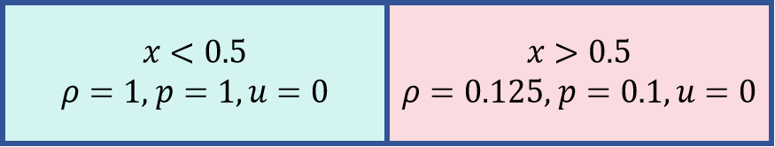
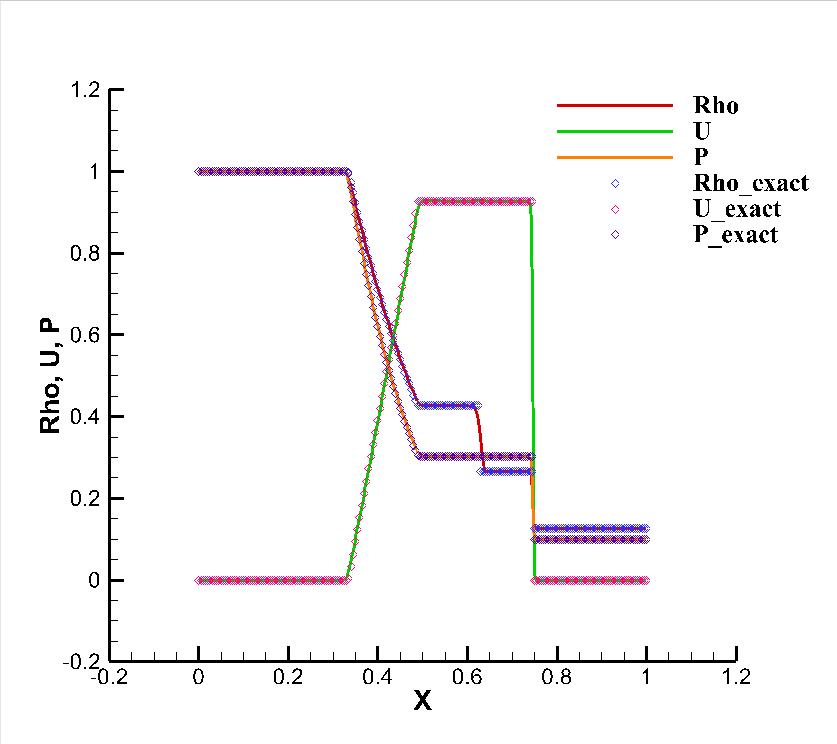

# Sod Shock Tube

CDUGKS Solver

```
gas-constant        1.0
gas-k               2       # gamma = 1.4
ref-length          1.0
ref-density         1.0
ref-temperature     1.0
```






## Quick Start

```sh
./tube  tube.txt
```
